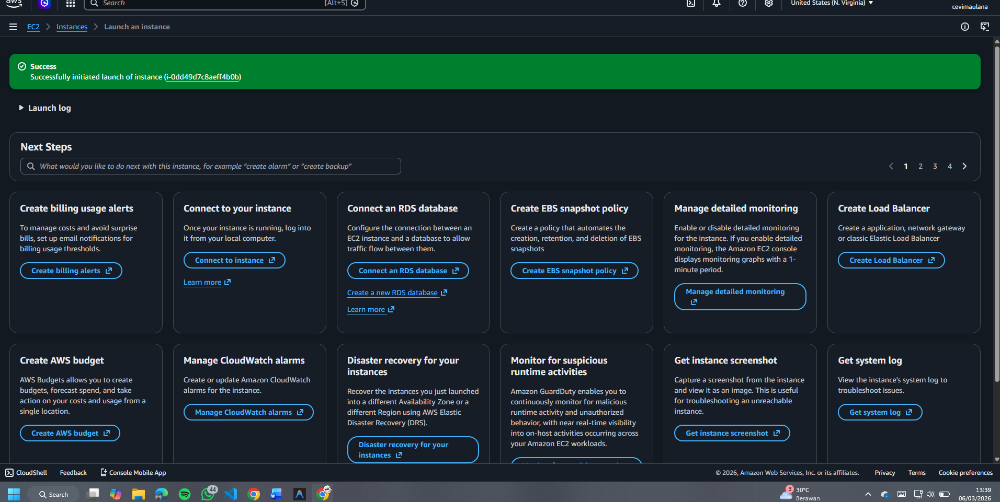
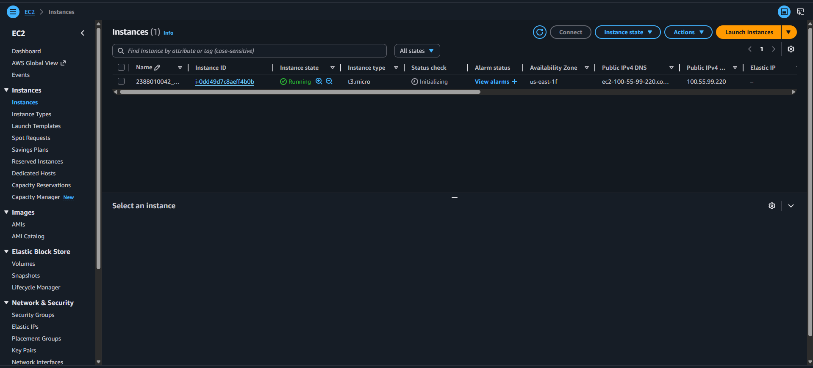

Membuat VM / Instance di AWS EC2 dgn AMI
Buka Menu EC2 dari Dashboard
Klik Menu Launch Instance
Pastikan Region memilih terdekat
Isi Nama Instance -> NIM_Server6A
OS pilih Linux Ubuntu
Instance Type pilih T3.Micro
Membuat Key Pair -> Create new Key Pair -> Isi Nama -> file .Pem -> Create
Network Security
Allow SSH Traffic
Allow HTTPS
Allow HTTP
Storage Setting -> 30Gb

Klik Launch Instance

Pastikan Alert Success

Pastikan nama sesuai -> klik Instance
