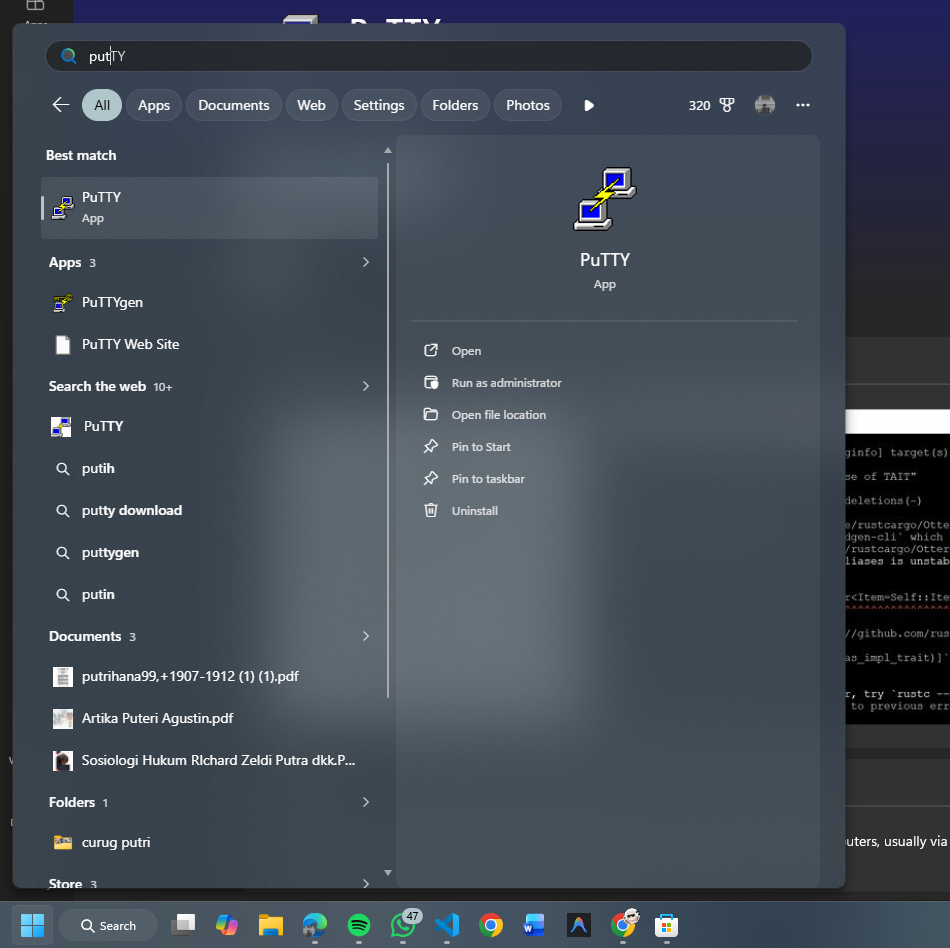
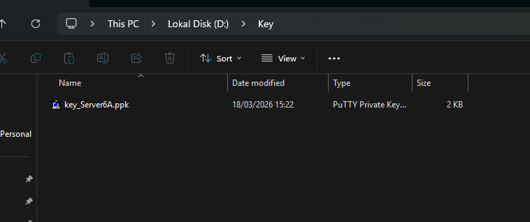
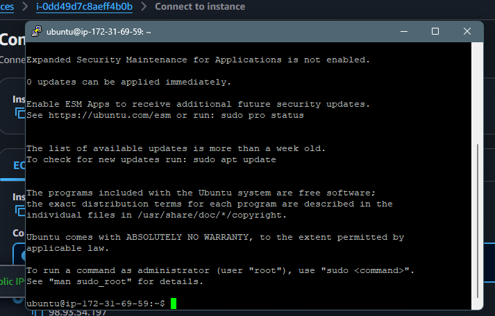
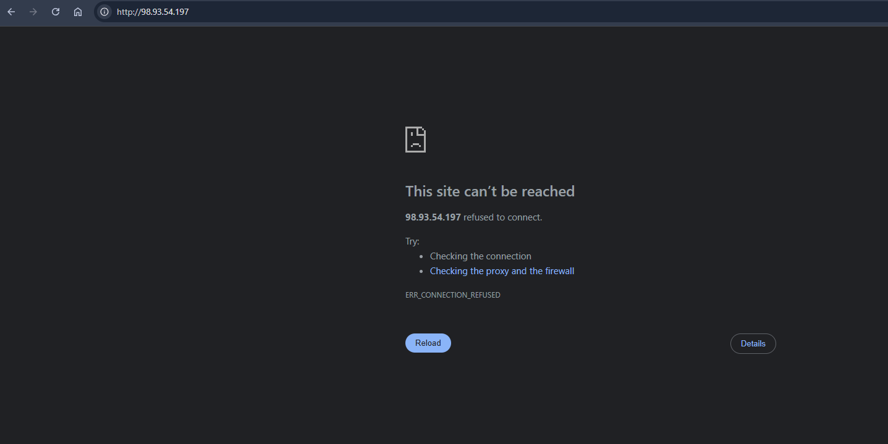
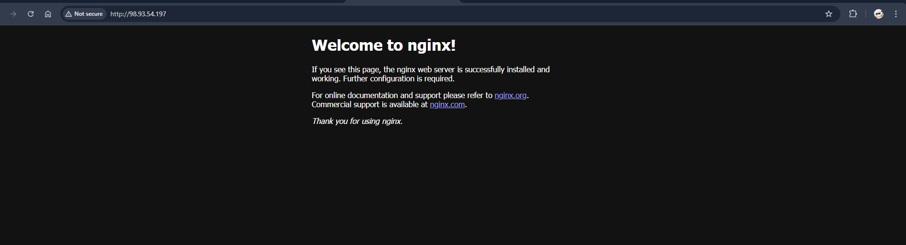

1. unduh dan Instal Putty di https://www.chiark.greenend.org.uk/~sgtatham/putty/latest.html

2. Konversi ekstensi Private Key dari .pem menjadi .ppk
Buka Putty Gen
Muat Kunci Pribadi .pem
Klik Save Private Key ekstensi menjadi File .ppk

3. Cara Mengatur SSH Jarak Jauh dengan Putty
isi alamat IPv4 Data publik berasal dari instance masing2
port SSH (22)
muat kunci pribadi .ppk di menu Koneksi->SSH->Otorisasi->Kredensial
pengguna dari instance masing-masing (ubuntu)

4. Setiap awal Remote kita melakukan Patching OS
sudo apt-get update && sudo apt-get upgrade

5. coba instalasi melakukan Web Server dalam keadaan Kosong

instal salah satu web server sudo apt install nginx
