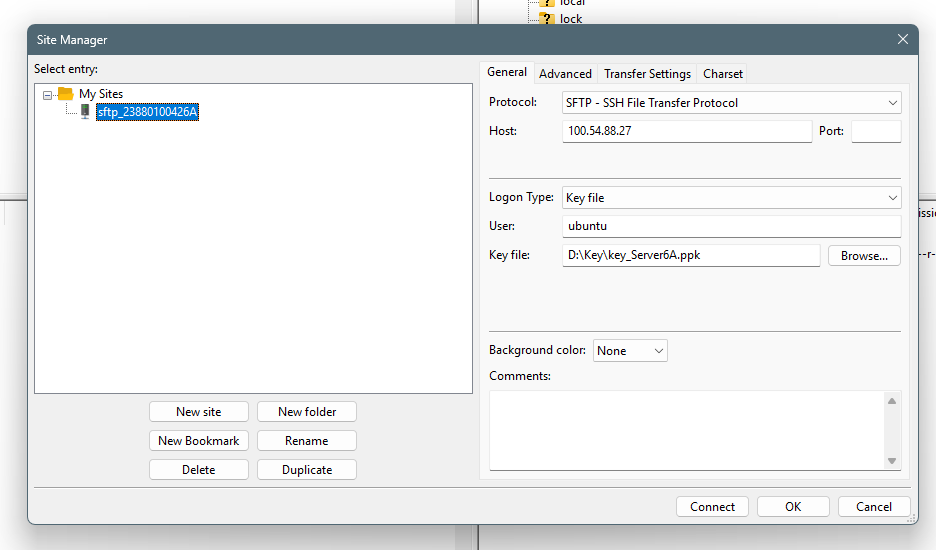
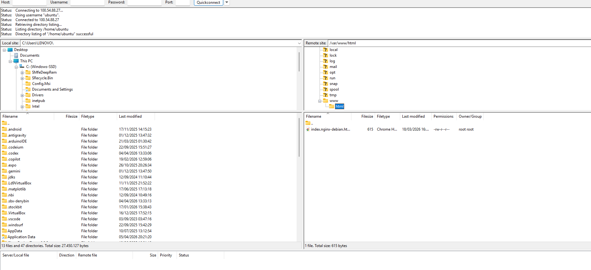
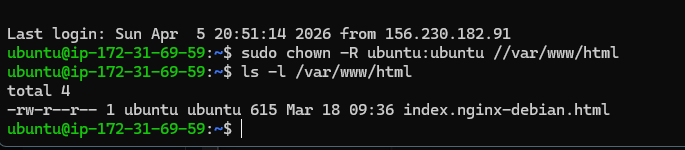
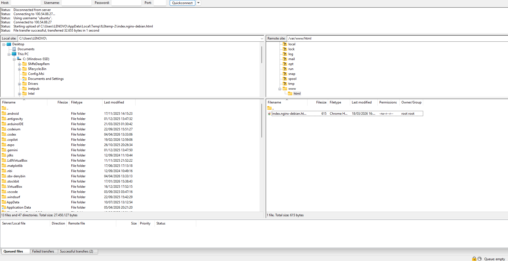
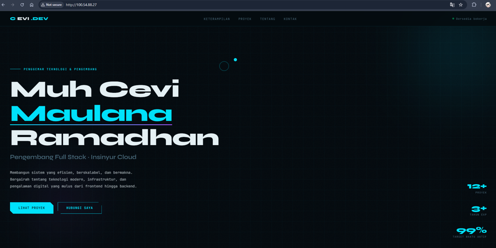
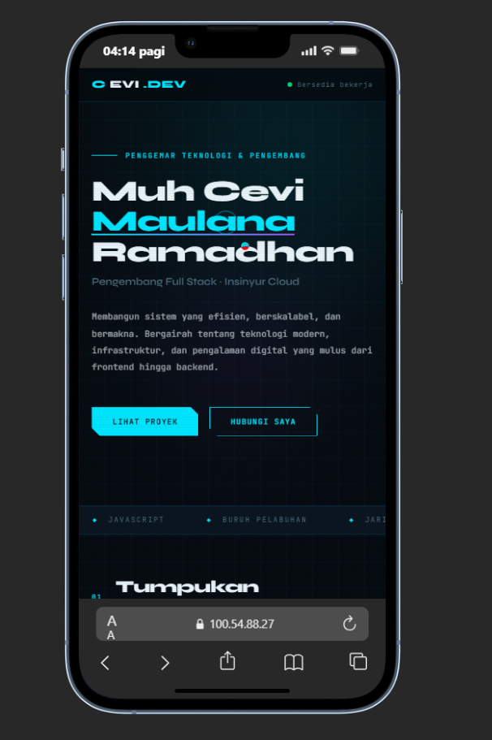

1. Unduh dan Instal FileZilla di https://filezilla-project.org/
2. Menjalankan Instance EC2 di AWS (instance -> start Instance)
3. Buka FileZilla dan masukkan data berikut:
Host: [ALAMAT_IP]
Nama pengguna: ubuntu
Kata sandi: [PASSWORD]
Pelabuhan: 22
Klik Hubungkan

4. Akses SSH jarak jauh melalui PowerShell Windows
masuk folder penyimpanan kunci pribadi
Buka dengan -> PowerShell
perintah masukan (ssh -i nama file-Private-Key.pem ubuntu@[IP_ADDRESS])

5. DIretori Folder Cloud arahkan ke Folder Web Services Area
Keluar dari direktori /home/ubuntu
Masuk ke direktori /var/www/html
buka file index.html dengan editor kode
akan gagal melakukan pengeditan - Izin ditolak
karena kita masuk user ubuntu tidak punya akses untuk menulis

6. Ubah Area Layanan Web Folder Hak Akses
ke Terminal PowerShell
perintah masukan (sudo chown -R ubuntu:ubuntu /var/www/html)
periksa kembali hak akses folder dengan perintah (ls -l /var/www/html)

7. kita lakukan editing pada file index.html setelah hak akses folder sudah diubah

8. Pastikan Desain Responsif
