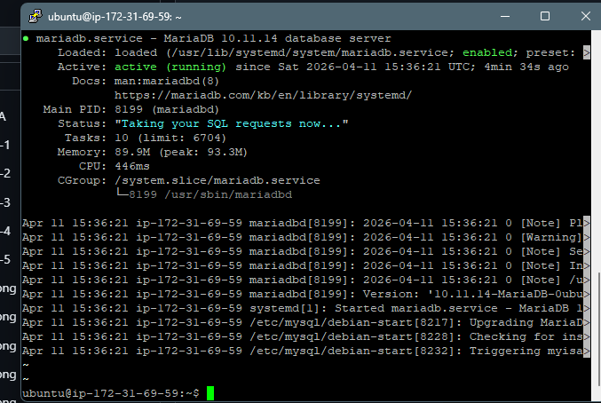
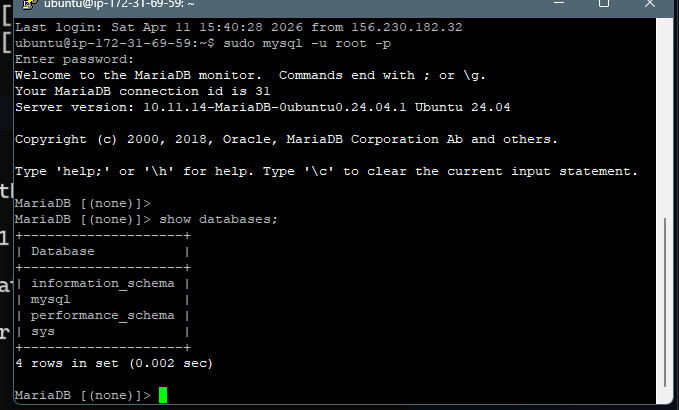
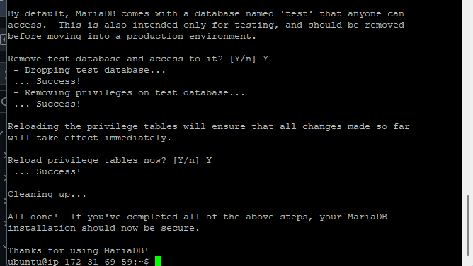
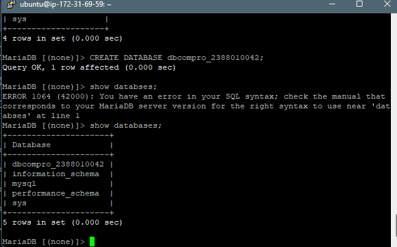
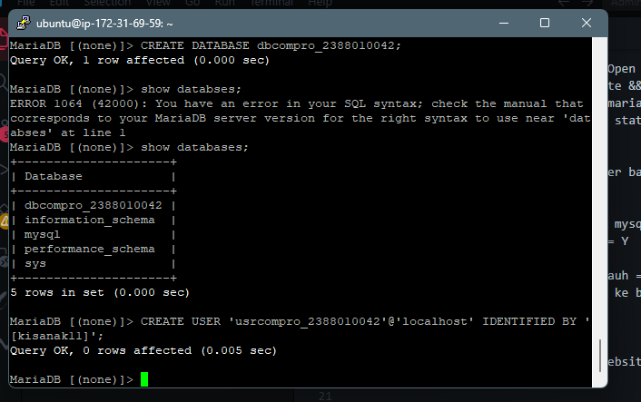
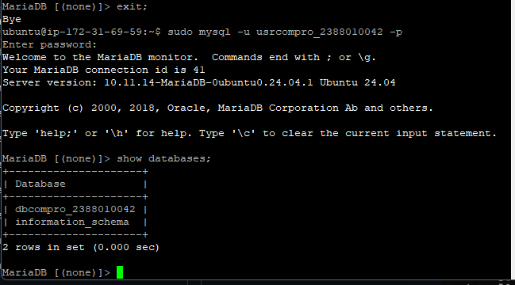

1. Aktifkan Instance AWS EC2
2. Akses Instans Jarak Jauh Melalui Open SSH Powershell / Putty
3. Memperbarui OS (sudo apt-get update && sudo apt-get upgrade)
4. Instal MariaDB (sudo apt install mariadb-server -y)
5. Periksa Status MariaDB (systemctl status mariadb)

6. Uji Pengaturan Default login server basis data sudo mysql -u root -p

7. Memperkuat Server Basis Data sudo mysql_secure_installation
Ubah kata sandi untuk pengguna root = Y
Hapus pengguna anonim = Y
Larang akses login root dari jarak jauh = Y
Hapus basis data pengujian dan akses ke basis data tersebut = Y
Muat ulang tabel hak akses = Y

8. Buat Profil Perusahaan DB untuk Website
Login sebagai root

Buat DB dengan nama dbcompro_NIM => CREATE DATABASE dbcompro_NIM;

Buat Pengguna dengan nama = usrcompro_NIM dan password = [PASSWORD] => CREATE USER 'usrcompro_NIM'@'localhost' IDENTIFIED BY '[PASSWORD]';

Berikan pengguna akses ke DB yang baru dibuat => GRANT ALL PRIVILEGES ON dbcompro_NIM.* TO 'usrcompro_NIM'@'localhost';

Hapus hak akses => HAPUS HAK AKSES;

KELUAR;

login sebagai usrcompro_NIM dan cek apakah bisa mengakses ke DB yang baru dibuat
